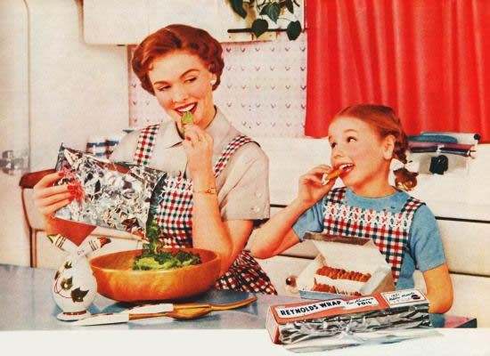

##jQuery Recipes Your Mom Should Know

> Get 'ya mom using these simple jQuery tips and she'll be rollin'!



###Back to Top Button

```javascript
// Back To Top
$('a.top').click(function () {
  $(document.body).animate({scrollTop: 0}, 800);
  return false;
});
```
```html
<!-- Create an anchor tag -->
<a class="top" href="#">Back to top</a>
```

When mom uses the `animate` and `scrollTop` functions in jQuery she doesn't need a plugin to create a simple scroll-to-top animation.

Changing the `scrollTop` value changes where 'ya mom wants the scrollbar to land. All she's really doing is animating the body of the document throughout the course of 800ms until it scrolls all the way to the top of the document.


###Checking If Images Are Loaded

```javascript
$('img').load(function () {
  console.log('image load successful');
});
```

Sometimes mom needs to check if her images are fully loaded in order to continue with her scripts. She can also check if one particular image has loaded by replacing the `` tag with an ID or class.


###Fix Broken Images Automatically

```javascript
$('img').error(function () {
  $(this).attr('src', 'img/broken.png');
});
```

Occasionally 'ya mom has times when there are broken image links on her website and replacing them one by one isn't easy. Adding this simple piece of code can save her a lot of headaches.

Even if she doesn't have any broken links adding this doesn't do any harm.


###Toggle Classes on Hover

```javascript
$('.btn').hover(function () {
  $(this).addClass('hover');
  }, function () {
    $(this).removeClass('hover');
  });
```

Mom usually wants to change the visual of a clickable element on her page when the user hovers over it. This snippet adds a class to her element when the user is hovering; when the user stops it removes the class. 'Ya mom just needs to add the necessary CSS.


###Disabling Input Fields

```javascript
$('input[type="submit"]').attr('disabled', true);
```

On occasion 'ya mom may want the submit button of a form or one of its text inputs to be disabled until the user has performed a certain action (e.g., checking the "I've read the terms" checkbox). This line of code adds the `disabled` attribute to mom's input so she can enable it when she wants to.

To do that all mom needs to do is run the `removeAttr` function on the input with disabled as the parameter:

```javascript
$('input[type="submit"]').removeAttr('disabled');
```


###Stop the Loading of Links

```javascript
$('a.no-link').click(function (e) {
  e.preventDefault();
});
```

Sometimes 'ya mom doesn't want links to go to a certain page or even reload it; she wants them to do something else like trigger some other script. This piece of code will do the trick of preventing the default action.


###Toggle Fade/Slide

```javascript
// Fade
$('.btn').click(function () {
  $('.element').fadeToggle('slow');
});
// Toggle
$('.btn').click(function () {
  $('.element').slideToggle('slow');
});
```

Slides and Fades are something we use plenty in our animations using jQuery. Sometimes mom just wants to show an element when we click something and for that the `fadeIn` and `slideDown` methods are perfect, but if she wants that element to appear on the first click and then disappear on the second this piece of code will work just fine.


###Simple Accordion

```javascript
// Close all Panels
$('#accordion').find('.content').hide();
// Accordion
$('#accordion').find('.accordion-header').click(function () {
  var next = $(this).next();
  next.slideToggle('fast');
  $('.content').not(next).slideUp('fast');
  return false;
});
```

By adding this script all mom really needs to do on her page is the necessary HTML go get this working. It's a simple method for a quick accordion.


###Make Two Divs the Same Height

```javascript
$('.div').css('min-height', $('.main-div').height());
```

Sometimes 'ya mom wants two divs to have the same height no matter what content they have in them. This little snippet enables just that; in this case it sets the `min-height` which means that it can be bigger than the main div but never smaller. This is great for masonry like websites.


###Zebra Stiped Unordered List

```javascript
$('li:odd').css('background', '#e8e8e8');
```

Mom can easily create zebra striped unordered lists by placing the background you define on every odd list item so that she can place the default one for the even ones in her CSS. 'Ya mom can add this snippet to any type of markup, from tables to plain divs, anything you want to be zebra stripped.
